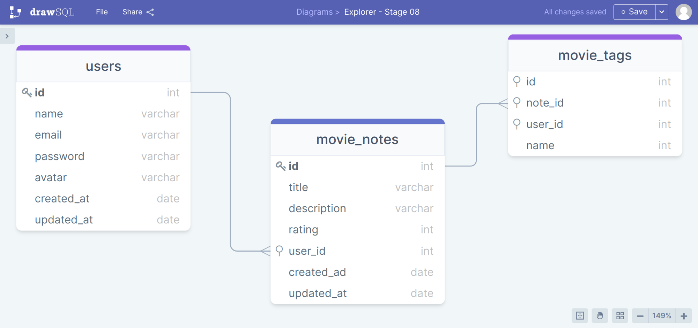

# API Movies

## Description

API in Node.js where the user registers a movie, fills in some information (name, description, note) and creates tags related to it.

The project is part of the course Explorer Rocketseat

## Technologies Used

- NodeJS
- Express
- Knex
- Sqlite

## Author

Josenito Lima Athayde.

## License

This project is licensed under the MIT license 

 